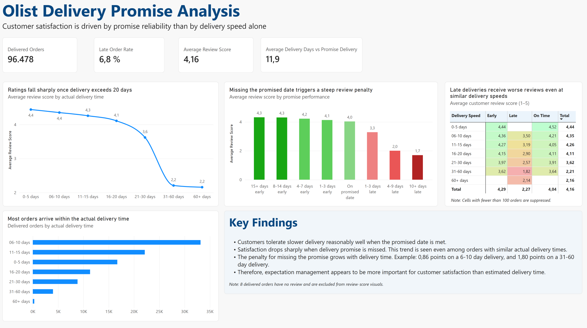
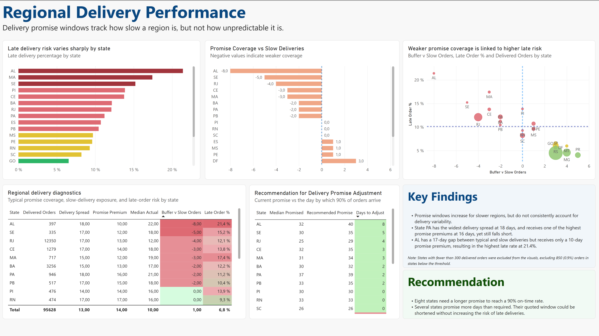
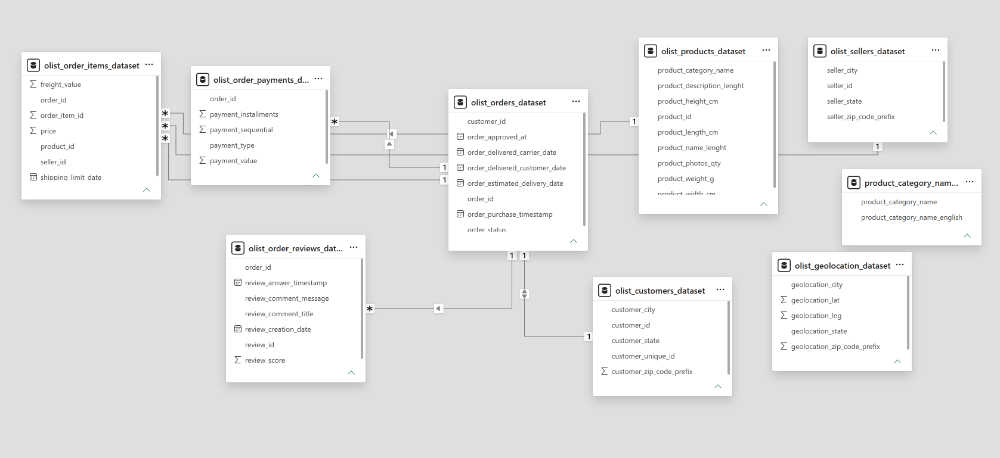
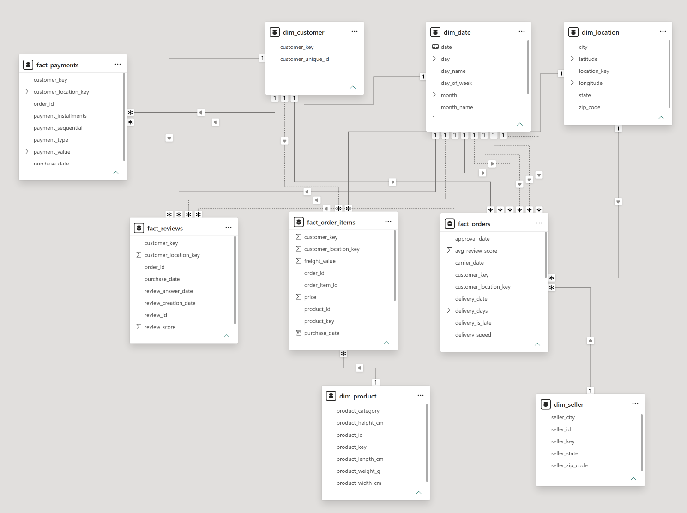

# olist_delivery_promise_analysis
A Power BI analysis of delivery promise reliability and calibration across Brazilian states, using 96k order data.
# About Olist
Olist is a Brazilian e-commerce marketplace connecting thousands of sellers to customers across the country. Since Olist operates in a large country with many different states and locations, delivery promises here matter a great amount for customer satisfaction. Whether delivery promises actually reflect these regional differences is not obvious from the data. How promises are set is an operational decision that affects both customer satisfaction and the credibility of the marketplace.
# The question
Two central questions were explored in this analysis:
1. Is customer satisfaction driven by how fast an order arrives, or by whether it arrives when promised?
2. Across all states, does the delivery promise window scale with delivery variability, or only with delivery speed?
The two questions are connected since the first one establishes what is actually responsible for customer satisfaction. The second asks whether Olist's delivery promises are set in a way that accounts for the satisfaction.
# Findings
**What drives customer satisfaction**
1. Customers tolerate slower delivery reasonably well when the delivery promise is met. Satisfaction drops sharply when the promised date is missed. This trend is seen even among orders with similar actual delivery times.
2. The penalty for missing delivery promise grows with delivery time. For example, for orders delivered in 6-10 days, missing the expected delivery timeline resulted in a customer review score that is 0.86 points lower than early ones. Among orders delivered in 31-60 days, this gap widens to 1.80 points.
3. Therefore, delivery expectation management appears to be more important for customer satisfaction than actual delivery time.



**Whether delivery promises are calibrated**
1. A closer look at delivery promise and actual delivery shows that promise window increases for slower regions, but does not consistently account for delivery variability.
2. State PA has the widest delivery spread in the country at 18 days and receives the largest promise premium of 16 days, still falling short of the expectation. In contrast, AL has a similar 17 day spread but receives only 10 days of delivery premium, resulting in the highest late rate nationally at 21.4%.
3. Eight of the states need a longer promise to reach a 90% on-time rate.
4. 91.9% of the orders arrive before the promised date, and only 1.3% arrive exactly on it, suggesting the fact that the promise functions as a ceiling rather than a target.
5. Several states promise more days than required. Their quoted window could be shortened without increasing the risk of late deliveries.



# Data model



**Applied Transformations**
- Flattened nine source tables into a star schema with five dimensions and four fact tables.
- Built dim_customer on customer_unique_id rather than customer_id, as customer_id is generated per order and does not represent a customer.
- Collapsed the geolocation table to one row per zip code. In a few cases a zip code appeared with multiple state values. They were mapped to the city and state pairing with the highest number of source records. This ensured that one zip code relates to the same city and state.
- Added a date dimension with role-playing relationships for purchase, approval, delivery, and estimated delivery dates.
- Replaced natural keys with surrogate keys across facts and dimensions.

**Grain**
| Table | One row per |
|---|---|
| fact_orders| order |
| fact_order_items| item line within an order |
| fact_payments| payment sequential line within an order |
| fact_reviews| review-to-order assignment |
| dim_customer| customer |
| dim_seller| seller |
| dim_product| product |
| dim_location| zip code |
| dim_date| calendar date |

fact_orders is an accumulating snapshot: one row per order, with date columns tracking purchase, approval, delivery, and the estimated delivery date.

fact_reviews contains 99,224 rows against 98,673 distinct orders and 98,410 review IDs. Some orders carry multiple reviews, and some review records are attached to more than one order. Where an order had multiple reviews, the scores were averaged before being merged into fact_orders as avg_review_score.

## Key measures
**Average Review Score (Min 100 Orders):** The average review of orders for an order count of >= 100, calculated from the measure "Average Review Score"
```DAX
Average Review Score (Min 100 Orders) = IF([Orders]>=100, [Average Review Score], BLANK())
```
**Promise Premium:** The median number of days Olist used as a buffer against the median of actual delivery days.
```DAX
Promise Premium = [Median Promised] - [Median Actual]
```
**Recommended Promise:**  The number of days it would require to successfully deliver 90% of a state's order, rounded to the next whole number.
```DAX
Recommended Promise = CEILING(PERCENTILE.INC(fact_orders[delivery_days], 0.90),1)
```
**Days to Adjust:** The number of days needed to increase/decrease in order to match the recommended promise.
```DAX
Days to Adjust = [Recommended Promise] - [Median Promised]
```
## Decisions and Limitations
1. 90% service level was used as a stated reference point rather than a finding.
2. States below 300 delivered orders were excluded from the analysis (850 orders, 0.9%)
3. Matrix cells below 100 orders were suppressed.
4. Review data shows the cost of being late but not the conversion cost of a longer quoted window.
5. 3.1% of customers placed more than one order. The dataset does not support a retention analysis, so that area was dropped.

## Tools
Power BI, Power Query, DAX
